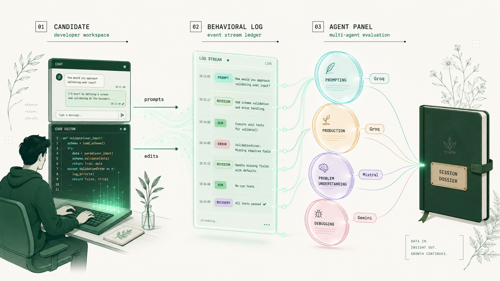
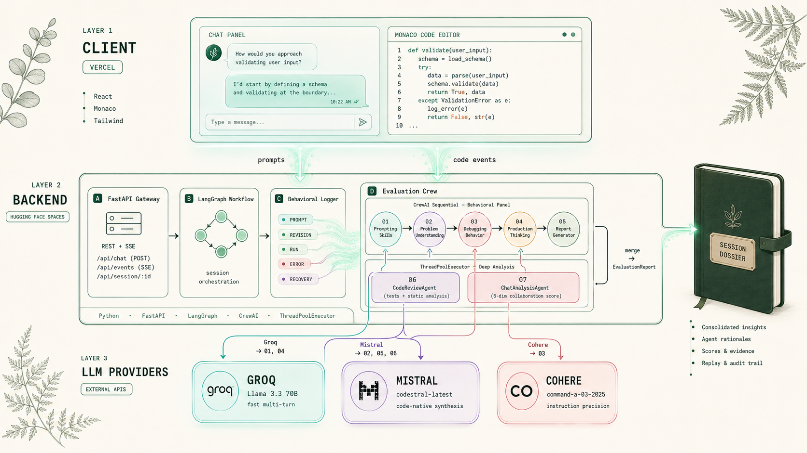
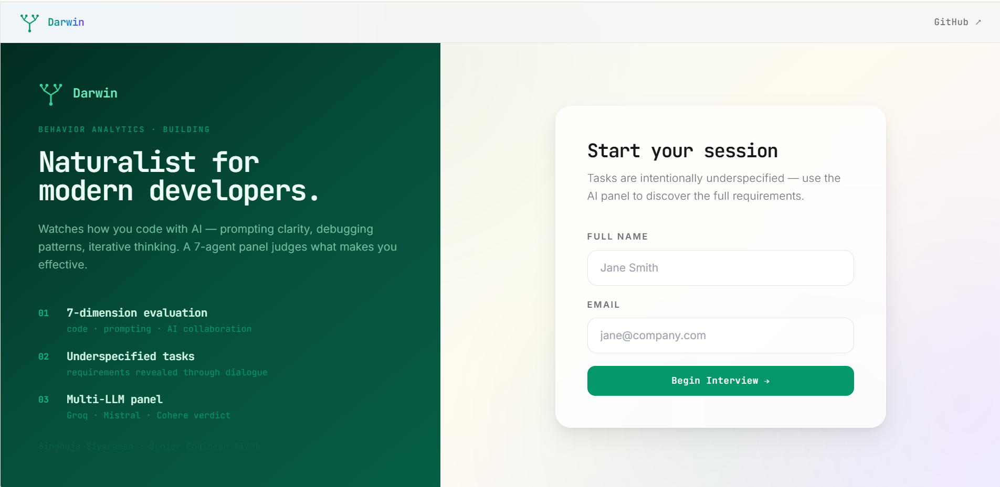
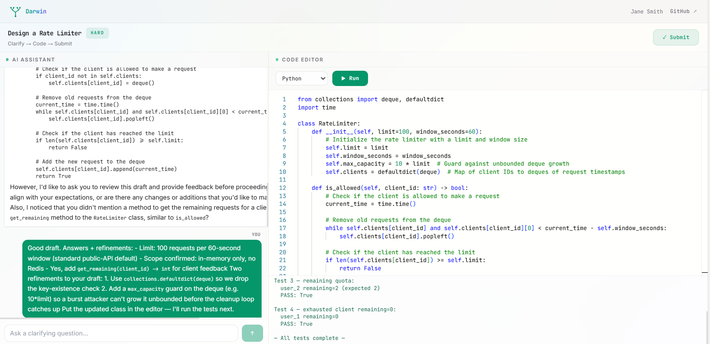
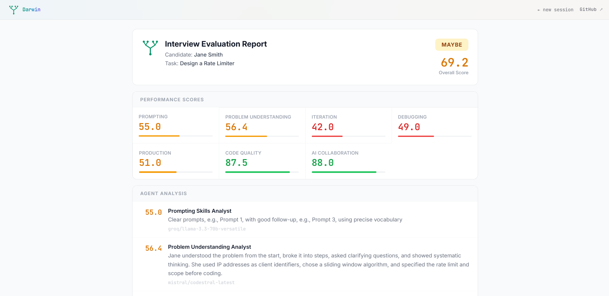
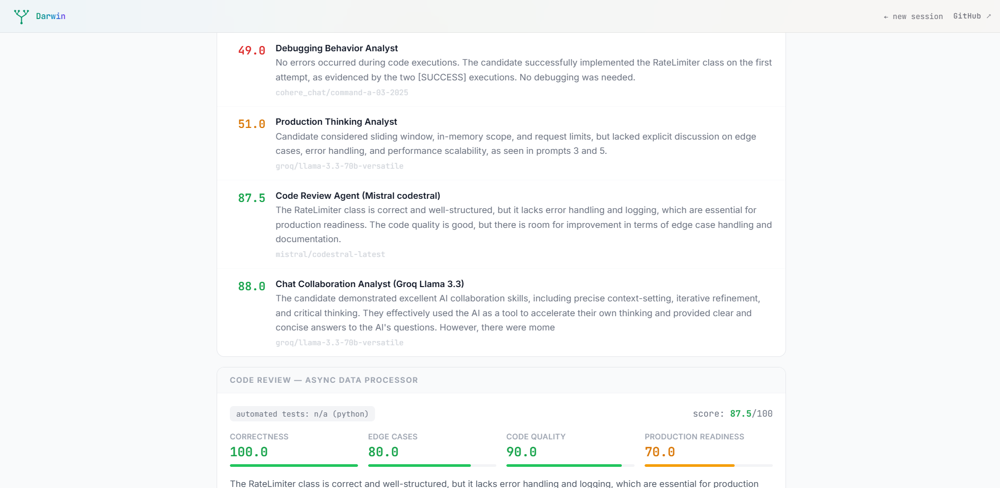
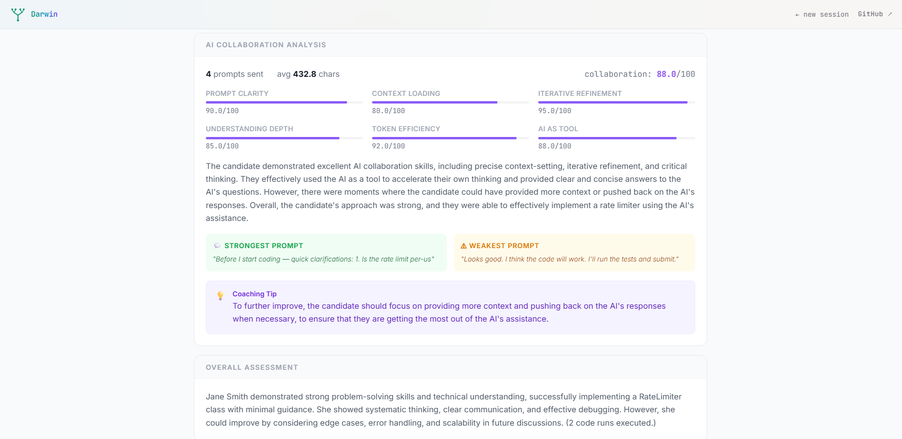

# Darwin

> *Naturalist for modern developers. Watches how you code with AI — then judges what makes you effective.*

<p align="center">
  
</p>

**Live:** [darwin-eta.vercel.app](https://darwin-eta.vercel.app)

---

## Why Darwin exists

A few months ago, I watched an interview with Aravind Srinivas, CEO of Perplexity. He spoke about knowledge — not how much we remember, but how we *work* with intelligence. The line that stayed with me:

> *We're moving from remembering things to working with intelligence.*

If intelligence is something we now *work with*, what does that say about how we judge ability?

I run L1 technical screening interviews almost daily. I started noticing the candidates who shipped well later were not always the ones with the cleanest interview code. They were the ones who broke problems down, asked sharper questions, recovered from errors systematically, and used AI as a thinking partner — not as a code dispenser.

Final code can't see any of that. Whiteboard rounds can't see any of that. So I built Darwin.

**One candidate. One problem. One chat. An AI beside them.** Not to help them cheat. Not to make things easy. To make thinking *visible*.

---

## Why "Darwin"

Darwin's real work was observation. He watched finches adapt to different islands, documented behavior across environments, and inferred which traits made a species *fit* — meaning, capable of thriving in the world it found itself in.

That's the same problem here. The world developers find themselves in is changing. AI is in the loop. The traits that mattered five years ago — memorization, syntax recall, perfect first-draft code — matter less. The traits that matter now are harder to see: **how a person breaks down a problem, how they prompt, how they recover from an error, how they iterate with AI as a collaborator.**

Survival of the fittest, in the AI-augmented engineering environment.

---

## What Darwin observes

Four behavioral signals — the ones traditional code review can't catch:

- **How they break a problem down** — clarifying questions vs. diving straight in
- **How they ask questions** — context-rich prompts vs. "make it work"
- **How they respond when the first answer is wrong** — re-read the error vs. re-prompt blindly
- **How they recover and iterate** — refining with the AI vs. starting over

Each signal becomes a stream in the behavioral log. The log feeds a 7-agent evaluation panel.

---

## How it's built

<p align="center">
  
</p>

Three layers, two deployments:

| Layer | What it does | Where it runs |
|---|---|---|
| **Client** | React + Monaco editor + chat panel | Vercel |
| **Backend** | FastAPI + LangGraph workflow + behavioral logger + evaluation crew | Hugging Face Spaces |
| **LLM Providers** | Groq · Mistral · Cohere — routed per agent | External APIs |

### The 7-agent evaluation panel

5 **CrewAI sequential** agents — behavioral analysis:

| # | Agent | LLM | What it scores |
|---|---|---|---|
| 01 | Prompting Skills Analyst | Groq Llama 3.3 70B | Multi-turn prompt clarity, context-loading, intent specification |
| 02 | Problem Understanding Analyst | Mistral codestral | Decomposition, edge-case reasoning, clarification quality |
| 03 | Debugging Behavior Analyst | Cohere command-a-03-2025 | Error reactions, hypothesis quality, recovery patterns |
| 04 | Production Thinking Analyst | Groq Llama 3.3 70B | Error handling, edge cases, what "done" actually means |
| 05 | Report Generator | Mistral codestral | Synthesis across the panel |

2 **ThreadPoolExecutor parallel** agents — deep analysis:

| # | Agent | LLM | What it scores |
|---|---|---|---|
| 06 | CodeReviewAgent | Mistral codestral | Two-pass: automated tests + LLM static analysis |
| 07 | ChatAnalysisAgent | Groq Llama 3.3 70B | 6-dimension AI collaboration quality |

The seven streams merge into a single `EvaluationReport`.

### Why this composition, not "just CrewAI"

CrewAI is sequential by design — perfect for the behavioral panel where each analyst builds on the last. But code review and AI-collaboration scoring don't need to wait on the panel; they have their own evidence (the diff, the chat log). So those run in parallel via `ThreadPoolExecutor`, which cuts total evaluation time roughly in half without losing fidelity.

### Why three LLM providers, not one

| Provider | Used by | Why |
|---|---|---|
| Groq Llama 3.3 70B | 01, 04, 07 | Fast multi-turn reasoning — keeps prompting and production analysis snappy |
| Mistral codestral | 02, 05, 06 | Code-native synthesis — strongest at code review and long-horizon reasoning |
| Cohere command-a-03-2025 | 03 | Instruction-following precision — best for structured debugging analysis |

Splitting across three providers also keeps any single token-budget ceiling out of the critical path.

---

## What a session looks like

### 1. Candidate begins

<p align="center">
  
</p>

Tasks are intentionally underspecified. The candidate has to *discover* the requirements through dialogue — exactly the way real engineering work begins.

### 2. Inside the session

<p align="center">
  
</p>

Chat panel on the left, Monaco editor on the right. Every prompt, every revision, every test run is logged in the background.

### 3. The verdict

<p align="center">
  
</p>

The 7-agent panel grades on a discriminating scale. Most candidates land in the **50–75 MAYBE band** — that's by design. The point isn't to crown winners; it's to surface where each candidate sits on each dimension.

### 4. Per-agent reasoning

<p align="center">
  
</p>

Each agent shows its score, the evidence it used, and the LLM that produced the verdict. Auditable. No black-box "score = 73."

### 5. AI Collaboration deep-dive

<p align="center">
  
</p>

The seventh agent — the part nothing else does. It pulls out the candidate's **strongest prompt**, **weakest prompt**, and a **coaching tip** for next time. The screenshot above is from my own demo session, where the lazy line *"I think the code will work"* got correctly flagged as the weakest signal.

---

## Tech Stack

| Layer | Stack |
|---|---|
| Frontend | React · Monaco Editor · Tailwind |
| Backend | Python · FastAPI · LangGraph · CrewAI · ThreadPoolExecutor |
| LLM Routing | Groq · Mistral · Cohere |
| Execution | Sandboxed Python / JavaScript runner |
| Deployment | Vercel (frontend) · Hugging Face Spaces (backend) |

---

## Project structure

```
Darwin/
├── backend/         FastAPI app — LangGraph workflow + CrewAI evaluation crew
│   ├── agents/      7 evaluation agents (5 sequential + 2 parallel)
│   ├── services/    Session manager, sandboxed code executor
│   └── workflows/   LangGraph interview state machine
├── client/          React UI — Monaco editor + chat panel
├── space_backend/   Dockerfile shim for Hugging Face Spaces deployment
└── assets/          Architecture diagrams + screenshots
```

---

## Run locally

### Backend
```bash
cd backend
python -m venv venv
source venv/bin/activate          # Windows: venv\Scripts\activate
pip install -r ../requirements.txt
cp .env.example .env              # add GROQ_API_KEY, MISTRAL_API_KEY, COHERE_API_KEY
python main.py
```

### Frontend
```bash
cd client
npm install
npm run dev
```

---

## What it deliberately does *not* do

- **Does not auto-reject.** Darwin produces evidence, not decisions. A human still hires.
- **Does not score the final code in isolation.** Code Review is one signal of seven, weighted accordingly.
- **Does not work for whiteboard problems.** Darwin scores AI-collaboration behavior — it needs an AI in the loop to do its job.
- **Does not replace senior judgment.** It surfaces signals a senior interviewer can verify in 60 seconds, not assemble from scratch in 45 minutes.

---

## What's next

- Recruiter-facing dashboard — aggregate candidate cohorts, calibration drift over time
- Customizable task library — let teams add their own underspecified problems
- Replay mode — re-watch a session step-by-step with the behavioral log overlaid

---

## Author

**Sindhuja Sivaraman** · Senior Engineer, AI/ML — HTC Global Services
[Portfolio](https://coding-chemist.vercel.app) · [GitHub](https://github.com/coding-chemist)

> *The future of hiring won't reward those who remember the most. It will notice who knows how to think with intelligence — especially alongside it.*
